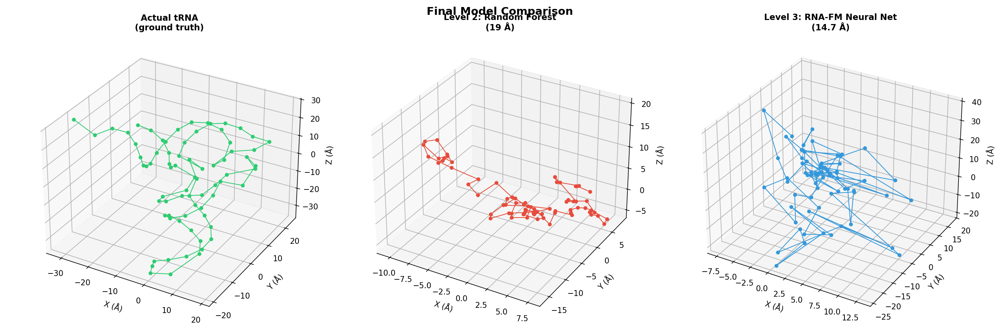

# RNA 3D Structure Prediction

Predicting the 3D coordinates of RNA molecules from sequence alone,
using a pipeline of three models of increasing sophistication.

Built as a learning project based on the
[Stanford RNA 3D Folding Kaggle Competition](https://www.kaggle.com/competitions/stanford-rna-3d-folding-2).

---

## The Problem

RNA molecules fold into 3D shapes that determine their biological function.
Predicting this shape from sequence alone is one of molecular biology's
remaining grand challenges — unlike proteins (solved by AlphaFold),
RNA has 30x less experimental data in the PDB (~7,000 vs ~220,000 structures).

Given an RNA sequence like `AUGCUAGCUA...`, predict the (x, y, z) coordinates
of each nucleotide's C1' atom in 3D space.

---

## Results

| Model | RMSD (Å) | Description |
|-------|----------|-------------|
| Level 1 — Straight line baseline | 131.81 Å | No ML — nucleotides placed 6.05 Å apart |
| Level 2 — Random Forest (5-mer) | 19.42 Å | Classical ML on local sequence context |
| Level 3 — ResNet + RNA-FM | **12.87 Å** | Deep learning with pretrained embeddings |

**90% improvement** from baseline to final model.



---

## Architecture
RNA Sequence (string of A/U/G/C)
│
▼
RNA-FM Transformer (99.5M parameters, pretrained on 23M sequences)
│
▼ 640-dim embedding per nucleotide
│
▼
ResNet Coordinate Predictor (494K parameters)
[Linear → BatchNorm → ReLU → Dropout] x 4
│
▼
(x, y, z) coordinates per nucleotide
---

## Key Learnings

**1. Data scarcity is the core challenge**
RNA has 30x less PDB data than proteins. AlphaFold was trained on 170,000+
protein structures — the best RNA models have ~7,000.

**2. More data beats better architecture**
Scaling from 1,000 to 6,700 training examples had more impact than
switching from a simple network to a ResNet.

**3. Problem framing matters more than model complexity**
Predicting absolute coordinates outperformed predicting displacement vectors
because displacement errors compound across 70+ autoregressive steps —
a 3 Å error per step becomes 47 Å total drift over a 73-nucleotide chain.

**4. Overfitting diagnosis is essential**
Training/validation curves revealed severe overfitting at a 362:1
parameter-to-data ratio. The correct fix was more data and early stopping,
not a bigger model.

**5. Transfer learning is powerful**
RNA-FM embeddings are 128x richer than integer-encoded 5-mers, encoding
evolutionary context from 23 million RNA sequences. This enabled a 34%
improvement over Random Forest with the same downstream architecture.

---

## Concepts Covered

| Concept | Where it appears |
|---------|-----------------|
| Exploratory data analysis | PDB structure parsing and visualization |
| Baseline modeling | Linear chain at 6.05 Å spacing |
| Feature engineering | 5-mer integer encoding for Random Forest |
| Transfer learning | RNA-FM pretrained embeddings |
| Overfitting and early stopping | Train/val curve diagnosis |
| Residual networks (ResNet) | Coordinate predictor architecture |
| BatchNorm and Dropout | Regularization in neural network |
| RMSD scoring | Standard structural biology metric |
| Autoregressive prediction | Displacement chaining and why it fails |
| Data scaling | PDB bulk download, 12 to 93 structures |

---

## Installation

```bash
git clone https://github.com/YOUR_USERNAME/rna-3d-structure-prediction
cd rna-3d-structure-prediction
pip install -r requirements.txt
```

---

## Usage

```python
from src.data import bulk_download
from src.models import RNACoordinatePredictor
import torch

# Download structures from PDB
structures = bulk_download(["1EHZ", "2GIS", "2GDI"])

# Load trained model
model = RNACoordinatePredictor()
model.load_state_dict(torch.load("models/final_abs_model.pth"))
model.eval()
```

See `notebooks/full_pipeline.ipynb` for the complete step-by-step walkthrough.

---

## Project Structure

rna-3d-structure-prediction/
├── README.md
├── requirements.txt
├── src/
│   ├── data.py          # PDB downloading and parsing
│   ├── models.py        # All model definitions (3 levels)
│   ├── features.py      # RNA-FM embedding extraction
│   ├── train.py         # Training loops with early stopping
│   └── evaluate.py      # RMSD scoring and visualization
├── notebooks/
│   └── full_pipeline.ipynb
├── figures/
│   ├── baseline_vs_reality.png
│   ├── overfitting_diagnosis.png
│   └── final_comparison.png
└── models/
└── final_abs_model.pth

---

## Background Reading

- **RNA-FM**: pretrained on 23M RNA sequences — [paper](https://arxiv.org/abs/2204.00300)
- **Protein Data Bank**: world repository of 3D structures — [rcsb.org](https://www.rcsb.org)
- **RMSD**: Root Mean Square Deviation — standard metric for comparing 3D structures
- **C1' atom**: sugar carbon tracked per nucleotide, one 3D point per residue
- **AlphaFold**: solved protein folding in 2021 — RNA equivalent is still open

---

## What's Next

- Fine-tune RNA-FM end-to-end instead of using frozen embeddings
- Add secondary structure prediction as an auxiliary loss
- Incorporate Multiple Sequence Alignments for evolutionary signals
- Scale to full PDB RNA dataset (~3,500 structures)
